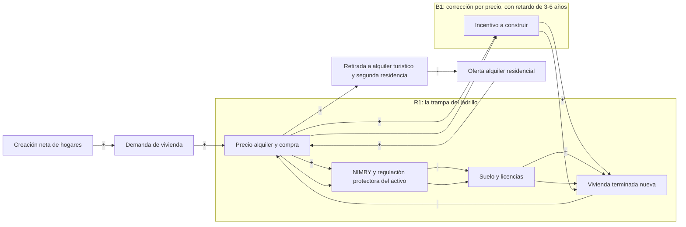
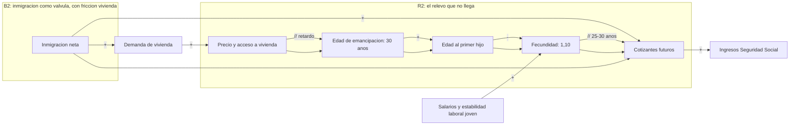
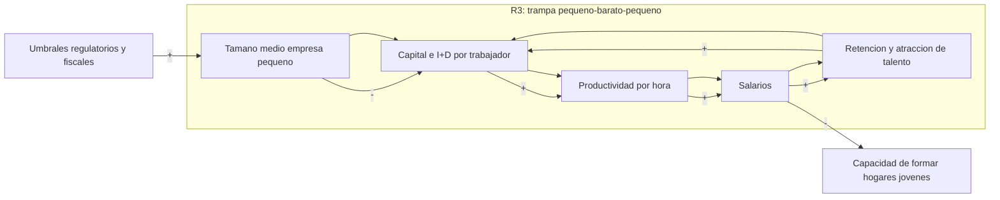
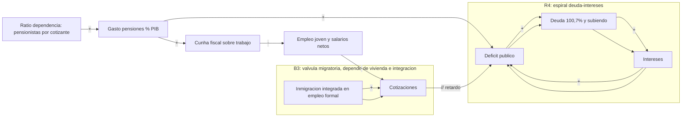
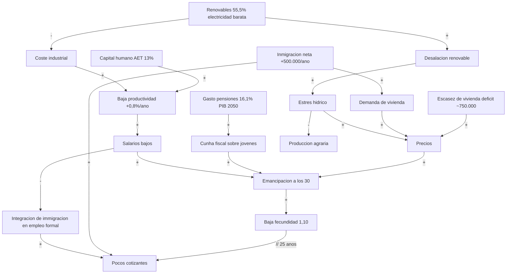

# **Cómo arreglar España: un análisis de sistemas complejos**

*Documento de análisis preparado para Andrés Santos Sanz. 7 de septiembre de 2026.*

*Método: dinámica de sistemas (stocks y flujos, diagramas de bucles causales, retardos) y jerarquía de puntos de palanca de Donella Meadows. Datos 2024-2026 de INE, Banco de España, AIReF, Eurostat, OCDE, SEPE, REE y Observatorio de Vivienda, con URLs en la sección de fuentes. Las cifras no citadas explícitamente son estimaciones y se marcan como tales. Los diagramas están en notación Mermaid (flowchart) con polaridad + (mueven en la misma dirección) y - (en dirección opuesta), R = bucle reforzador, B = bucle equilibrador, // = retardo relevante.*

## **1. Resumen ejecutivo**

España no tiene ocho problemas separados. Tiene un sistema socioeconómico con tres bucles reforzadores trabados entre sí, más un cuarto bucle virtuoso que funciona y que casi nadie conecta con los demás:

- **El bucle del relevo (vivienda ↔ emancipación ↔ natalidad):** la escasez de vivienda (déficit acumulado de unas 750.000 viviendas entre 2021 y 2025, según el Banco de España) encarece el alquiler (+8,5% solo en 2025), retrasa la emancipación hasta los 30 años (frente a 26,2 en la UE) y empuja la fecundidad a 1,10 hijos por mujer. Menos hijos hoy significa menos cotizantes dentro de 25 años, justo cuando el gasto en pensiones se dirige al 16,1% del PIB.

- **La trampa de la baja productividad (tamaño empresarial ↔ salarios ↔ cualificación):** un tejido de empresas pequeñas que invierten poco en capital y formación por trabajador, pagan salarios bajos, retienen mal el talento y no crecen. La productividad por hora creció al 0,8% anual durante 25 años y toda la brecha de renta con Alemania (-20% de PIB per cápita) es brecha de productividad, no de horas trabajadas.

- **La cuña intergeneracional (pensiones ↔ fiscalidad ↔ jóvenes):** el ajuste del sistema de pensiones se está haciendo por el lado de ingresos (más cotizaciones sobre los salarios de los jóvenes actuales), que son los mismos jóvenes a los que la vivienda y el mercado laboral ya penalizan. La deuda pública (100,7% del PIB a cierre de 2025) iría al 129% en 2050 y al 181% en 2070 según la AIReF si no cambia la estructura.

- **El bucle virtuoso disponible (energía barata ↔ industrialización):** España generó el 55,5% de su electricidad con renovables en 2025 (récord de 150.988 GWh). Es la única gran palanca de costes que ya gira a favor, y está desconectada de la política industrial, de la vivienda (electrificación) y del agua (desalación renovable).

La tesis central: la mayoría de las políticas aplicadas o propuestas operan en los niveles bajos de la jerarquía de Meadows (parámetros: subvenciones, topes de precios, cheques) y, al no tocar la estructura, alimentan los bucles perversos. La evidencia más clara es el control de alquileres sin choque de oferta (reduce la oferta y sube el precio del resto) y las ayudas a la demanda de vivienda (se capitalizan en precios). Los puntos de palanca de alto impacto son, en orden creciente de potencia: retrasar menos y construir más (estructura de stocks), reglas automáticas de ajuste de pensiones, información de empleabilidad educativa, auto-organización (FP dual, unidad de mercado), cambio de objetivos (vivienda como infraestructura, sostenibilidad intergeneracional medible) y cambio de paradigma (la inmigración y el agua como activos estratégicos, no como problemas).

## **2. Método: cómo leer este análisis**

Un sistema complejo no se arregla pieza a pieza porque las piezas se responden entre sí, con retardos. Tres herramientas:

- **Stocks y flujos:** los stocks (parque de viviendas, población en edad de trabajar, capital humano, deuda, recursos hídricos) solo cambian por flujos (construcción neta, nacimientos menos defunciones más migración neta, formación, déficit, precipitación menos consumo). Casi todos los titulares políticos son sobre flujos; casi todos los problemas graves son de stocks.

- **Bucles de retroalimentación:** reforzadores (R, círculos viciosos o virtuosos) y equilibradores (B, correcciones). Los problemas crónicos españoles son bucles R que nadie revierte, y las soluciones duras son bucles B que alguien tiene que activar a mano.

- **Retardos:** entre la decisión y el efecto hay años (vivienda: 3-10; educación: 10-15; demografía: 25). Los retardos explican por qué los gobiernos invierten en parámetros visibles en 12 meses en lugar de estructura visible en 10 años.

La jerarquía de Meadows ordena los puntos de intervención de menor a mayor potencia: (12) parámetros y constantes, (11) amortiguadores, (10) estructura física de stocks y flujos, (9) retardos, (8) bucles equilibradores, (7) bucles reforzadores, (6) flujos de información, (5) reglas del sistema, (4) capacidad de auto-organización, (3) objetivos del sistema, (2) paradigmas, (1) trascender paradigmas. La regla práctica: intervenciones de nivel alto son más potentes pero más lentas y políticamente más difíciles; un portfolio serio combina niveles.

## **3. El mapa: stocks y flujos del sistema España**

| Stock | Flujo de entrada | Flujo de salida | Estado 2025-2026 |
| --- | --- | --- | --- |
| Parque de viviendas disponibles | Vivienda terminada nueva; movilización de vacías | Demolición, retirada del alquiler, segunda residencia y turística | Déficit acumulado 2021-2025 de ~750.000 viviendas frente a creación de hogares (-3,9% de los hogares, solo peor Portugal en la muestra del BdE). Parque social público: ~318.000 viviendas, el 1,72% de los hogares (3,3% en sentido amplio) |
| Población en edad de trabajar | Nacimientos (con retardo de 20-30 años), inmigración neta | Defunciones, emigración, jubilación | Población total 49,13 M (+508.602 en un año, casi todo migración). Fecundidad 1,10. Saldo vegetativo -122.167 en 2025. Proyección INE: 54,6 M en 2074 con +17,1 M de saldo migratorio acumulado |
| Capital humano | Educación, FP, formación en empresa, inmigración cualificada | Jubilación, emigración de cualificados, obsolescencia | Abandono educativo temprano 13% (mínimo histórico, aún 3,5 pp sobre la media UE). 52,6% de 25-34 años con educación superior. PISA en torno a la media OCDE sin despegar |
| Capital productivo por trabajador | Inversión empresarial, I+D, digitalización | Depreciación, deslocalización | Productividad por hora +0,8% anual acumulado en 25 años; PIB per cápita -8,5% frente a la media europea y -20% frente a Alemania (íntegramente por productividad) |
| Deuda pública | Déficit, intereses | Superávit, crecimiento nominal, inflación | 100,7% del PIB a cierre de 2025. Senda AIReF: 129% en 2050, 181% en 2070 |
| Recursos hídricos renovables | Precipitación, desalación, reutilización | Regadío (80% del agua extraída), abastecimiento (16%), industria (4%) | Estrés estructural: 12,9 Mha de secano y 3,7 Mha de regadío expuestas a sequías cada vez más frecuentes |
| Capacidad eléctrica renovable y red | Nueva potencia, almacenamiento, interconexiones | Cierres, congestión de red, colas de conexión | 55,5% de generación renovable en 2025 (56,6% contando autoconsumo), solar 18,4% del mix. La red y los permisos, no el recurso, son el cuello de botella |

## **4. Los subsistemas, uno a uno**

### **4.1 Vivienda: un problema de stock tratado como problema de precio**

El diagnóstico del Banco de España es de manual de dinámica de sistemas: desde 2021 la creación neta de hogares supera sistemáticamente a la vivienda terminada, y el diferencial acumulado llega a unas 750.000 viviendas. El mercado responde como responde cualquier stock escaso con demanda creciente: el alquiler subió un 8,5% en 2025 (14,7 €/m² de media; 23,8 en Barcelona, 22,7 en Madrid) y la compra crece por encima de la renta de los hogares. El stock público de alquiler social es residual: 1,72% de los hogares, frente a cifras de dos dígitos en países como Austria o Países Bajos.

Los bucles dominantes:

El bucle equilibrador natural (precio alto → construir más → precio baja) existe pero está amortiguado por tres retardos: suelo y licencias (2-5 años), construcción (2-3 años) y, sobre todo, por el bucle reforzador R1: quienes ya tienen vivienda ven subir su activo y votan contra la oferta nueva en su municipio. El sistema, dejado solo, equilibra precios altos con escasez, no precios bajos con abundancia. Los efectos perversos documentados: topes de alquiler sin oferta nueva reducen el stock ofertado y desplazan el precio al segmento no regulado; las ayudas al alquiler sin oferta se capitalizan en el precio (el casero captura la ayuda).

### **4.2 Demografía: el flujo que manda sobre todos los demás**

Los datos de 2024-2025: 318.005 nacimientos en 2024 y 321.164 estimados en 2025 (+1,0%, primer repunte en una década, provisional); fecundidad de 1,10 hijos por mujer (1,07 en madres españolas, 1,27 en extranjeras); saldo vegetativo de -122.167 personas en 2025; un 33,3% de los nacimientos ya son de madres nacidas en el extranjero. La población crece solo por migración: +508.602 personas en un año, 14,1% de extranjeros, 19,3% de nacidos fuera. El INE proyecta 54,6 millones en 2074, escenario que exige un saldo migratorio acumulado de 17,1 millones.

El punto de sistemas que casi nunca se dice: la política de natalidad española se debate como política de cheques (parámetros, nivel 12 de Meadows), cuando la variable con más evidencia causal es la vivienda. Una generación que se emancipa a los 30 no puede tener dos hijos aunque quiera. Y la inmigración, que es el único flujo que cierra el balance demográfico y el de la Seguridad Social hoy, entra en el mismo mercado de vivienda tensionado: sin oferta, más población es más precio, lo que a su vez erosiona el apoyo político a la inmigración que el sistema de pensiones necesita. Es un bucle acoplado, no dos debates separados.

### **4.3 Productividad y tejido empresarial: el stock que decide los salarios**

El Consejo de Productividad lo resume así: el PIB per cápita español está un 8,5% por debajo de la media europea, pero frente a Alemania la brecha (-20%) es íntegramente de productividad por hora: los españoles trabajan más horas por habitante y producen menos por hora. En 25 años la productividad por hora creció un 20,2% acumulado (0,8% anual), menos que Alemania (24,7%). Las causas estructurales conocidas: empresas pequeñas que no escalan (umbrales regulatorios y fiscales que penalizan crecer), baja inversión en capital e I+D por trabajador, mercado interior fragmentado por normas autonómicas y un sistema financiero que premia el ladrillo sobre el capital productivo (ver R1).

Este es el bucle que convierte el crecimiento del PIB (2,9% en 2025, muy por encima de la eurozona) en una decepción salarial: España crece añadiendo horas y personas (muchas vía inmigración) más que añadiendo valor por hora. El modelo crece, pero no converge.

### **4.4 Mercado laboral y formación: dualidad mutada, no resuelta**

La reforma de 2021-2022 redujo la temporalidad general, pero el informe del SEPE sobre jóvenes muestra dónde se refugió la dualidad: temporalidad juvenil del 59,26% en 2025, índice de rotación de 2,30 y paro juvenil del 23-24% a finales de 2025, frente al 14-15% de la UE, el 6,8% de Alemania y el 9% de Países Bajos. El stock de capital humano joven entra en un mercado que lo rota en vez de entrenarlo. La conexión con el bucle R2 es directa: sin estabilidad ni salario a los 25-30, no hay emancipación ni primer hijo; y la conexión con R3 también: las empresas que rotan jóvenes no invierten en su formación, porque no capturan el retorno.

El bucle equilibrador disponible y probado en Europa es la FP dual de calidad (empresa que entrena retiene), pero en España sigue siendo marginal frente al modelo alemán. La educación universitaria, por su parte, no publica información de empleabilidad por titulación y centro: el mercado formativo funciona a ciegas (nivel 6 de Meadows: flujos de información inexistentes).

### **4.5 Pensiones y sostenibilidad fiscal: un ajuste ya decidido, disfrazado de no-decisión**

Los números de la AIReF (2026): el gasto en pensiones pasa del 12,7% del PIB en 2022 al 16,1% en 2050 (+3,4 puntos, revisado al alza); las medidas de ingresos aportan el 1,6% del PIB; el déficit público alcanzaría el 7% del PIB en 2050 y la deuda el 129% (181% en 2070). En términos de sistemas: el stock de derechos de pensión crece por inercia demográfica (los cotizantes de 2050 ya nacieron; es de los pocos flujos sin incertidumbre), y el sistema político ha elegido ajustar por el lado de ingresos: MEI, cotización de solidaridad, bases máximas. Eso sube la cuña fiscal sobre el trabajo joven, que interactúa con el paro juvenil del 24% y con la fecundidad: el ajuste se carga sobre el flujo que el sistema más necesita proteger.

El punto de palanca de nivel 5 (reglas) aquí es conocido y aplicado en Suecia, Italia o Japón: un factor de sostenibilidad automático que indexa la edad efectiva o la prestación a la esperanza de vida y al ratio de dependencia, sacando el ajuste del ciclo electoral. España tuvo uno en 2013 y lo derogó; hoy el ajuste existe igualmente, pero es discrecional, opaco y regresivo por cohortes.

### **4.6 Educación: el bucle más lento y más desatendido**

Buenas noticias reales: el abandono educativo temprano marcó mínimo histórico en 2024 (13%, desde 21,9% en 2014), y el 52,6% de los jóvenes de 25-34 años tiene educación superior, por encima del objetivo europeo de 2030. Malas noticias: el 13% sigue 3,5 puntos por encima de la media UE, la brecha es concentradamente masculina (15,8% hombres, 10% mujeres) y los resultados PISA 2022 sitúan a España en la media OCDE sin mejora de tendencia, con fuerte dependencia del origen socioeconómico. En términos de sistemas: la educación es el flujo de entrada al stock de capital humano, con el retardo más largo de todo el mapa (10-15 años hasta el mercado laboral), lo que la hace políticamente invisible: ningún gobierno cosecha lo que siembra en primaria. Por eso el punto de palanca no es solo gasto (parámetro) sino información y reglas: publicar resultados y empleabilidad por centro, carrera profesional docente real, y FP dual como vía de prestigio, no de descarte.

### **4.7 Energía, agua y clima: la ventaja sin conectar**

Energía: 2025 cerró con el 55,5% de generación renovable (56,6% con autoconsumo), récord de 150.988 GWh, solar fotovoltaica ya al 18,4% del mix. Es un bucle virtuoso en marcha: recurso barato → coste eléctrico competitivo → atracción de industria electrointensiva y centros de datos → demanda que justifica más inversión. Los cuellos de botella son de stock físico y de reglas: red, almacenamiento, interconexión con Francia y colas de permisos, no el sol. Agua: el regadío consume el 80% del agua extraída con 3,7 Mha; el cambio climático reduce la aportación y la agricultura concentra el 80% de los impactos de la sequía. El precio político del agua de riego (muy por debajo del coste) es un bucle reforzador de sobreuso: agua barata → cultivo intensivo de alto consumo → estrés hídrico → inversión de emergencia en infraestructura cara (trasvases, desalación) financiada por todos. La conexión obvia y desaprovechada: desalación y bombeo alimentados con solar barata convierten el bucle del agua de sumidero fiscal en aplicación industrial de la ventaja energética.

## **5. Los cuatro bucles transversales que lo atan todo**

Si se analiza por ministerios, todo lo anterior parecen ocho políticas. El sistema real tiene cuatro acoplamientos que dominan el comportamiento:

1. **Vivienda → natalidad → pensiones (el bucle del relevo):** la escasez de vivienda es hoy la política de natalidad más potente (en negativo) y, con 25 años de retardo, la mayor amenaza a la sostenibilidad de las pensiones. Ninguna partida de natalidad compensa una emancipación a los 30.

2. **Pensiones → cuña fiscal → jóvenes → inmigración (el bucle del equilibrista):** el sistema se sostiene con inmigración neta de medio millón de personas al año, pero la inmigración solo cotiza si entra en empleo formal (mercado laboral) y solo se queda si puede alquilar (vivienda). Bloquear la vivienda es, vía este bucle, bloquear la financiación de las pensiones.

3. **Educación → productividad → salarios → fecundidad (el bucle lento):** es el bucle de convergencia con Europa. Tarda 15 años, nadie lo ve en un mandato, y por eso el sistema político invierte en parámetros visibles. Es también el único que sube los salarios sin subir precios.

4. **Energía barata → industrialización → agua (el bucle de la ventaja):** la única palanca de costes que ya gira a favor. Conectarla con industria, vivienda electrificada y desalación es la oportunidad estratégica de la década; desperdiciarla en colas de permisos es el mayor coste de oportunidad auto-infligido.

## **6. Los 8 puntos de palanca de mayor impacto (jerarquía de Meadows)**

Ordenados de menor a mayor nivel (y potencia), con el bucle que cada uno ataca:

1. **Nivel 9-10 (retardos y estructura de stocks) - Choque de oferta de vivienda donde están los empleos:** liberalización real de suelo urbanizable en municipios tensionados, licencias por plazo máximo con silencio positivo, industrialización de la construcción y objetivo de parque público de alquiler del 1,72% al 5-7% de hogares en 15 años. Ataca R1, R2 y B2. Retardo 3-10 años. Sin esto, todo lo demás en natalidad e inmigración es cosmético.

2. **Nivel 9 (retardos) - Adelantar el calendario de formación-empleo:** FP dual masiva y contratos formativos reales para que el primer empleo estable llegue a los 22-24, no a los 28. Reduce el retardo del bucle lento sin esperar 15 años. Ataca la entrada a R2 y R3.

3. **Nivel 8 (bucle equilibrador) - Precio real del agua con protección social:** tarificación por coste en regadío con tarifa social para abastecimiento, y destinar la recaudación a modernización de riego y reutilización. Activa el bucle B que hoy está desconectado por el precio político. Ataca el bucle del agua.

4. **Nivel 7 (bucle reforzador) - Romper la trampa del tamaño empresarial:** eliminar los umbrales que penalizan pasar de 10, 50 y 250 empleados (obligaciones que saltan por tramos), mercado único interior efectivo (una norma para vender en toda España) y ventanilla de crecimiento. Ataca R3 directamente.

5. **Nivel 6 (flujos de información) - Transparencia de empleabilidad y resultados educativos:** publicar, por titulación y centro, inserción, salario a los 3 años y resultados estandarizados. La información barata redirige miles de decisiones de familias y centros sin una sola subvención. Ataca el bucle lento por su punto más barato.

6. **Nivel 5 (reglas) - Factor de sostenibilidad automático y simétrico de pensiones:** indexación legal de parámetros del sistema a esperanza de vida y ratio de dependencia, con evaluación pública anual de la AIReF. Sustituye ajustes opacos por una regla predecible que los mercados y las cohortes pueden planificar. Ataca R4.

7. **Nivel 4 (auto-organización) - Desregular la respuesta local:** permitir que municipios y comunidades experimenten con densidad, usos mixtos y vivienda asequible sobre suelo público (y que capturen fiscalmente parte del valor que crean), en lugar de un único modelo normativo nacional. Los sistemas complejos se arreglan mejor con variedad local que con uniformidad impuesta.

8. **Nivel 3-2 (objetivos y paradigma) - Redefinir qué es éxito:** que el objetivo declarado del sistema deje de ser "proteger cada posición adquirida" (del propietario, del pensionista actual, del funcionario, del sector regulado) y pase a ser la tasa de emancipación, la fecundidad deseada vs real, la productividad por hora y la deuda por cotizante. Un sistema optimiza lo que mide: hoy España mide paro y PIB; debería medir convergencia y relevo generacional.

## **7. Portfolio de intervenciones: efectos, retardos y efectos perversos**

| Intervención | Nivel Meadows | Efecto esperado | Retardo | Riesgo de efecto perverso | Mitigación |
| --- | --- | --- | --- | --- | --- |
| Choque de suelo y licencias en zonas tensionadas + parque público de alquiler al 5-7% | 9-10 | Freno del precio real, emancipación antes de los 28, apoyo a natalidad e inmigración | 3-10 años | Si se acompaña de topes de precios previos, los promotores anticipan menor retorno y la oferta no llega | Secuenciar: primero oferta y reglas estables, regulación de precios solo transitoria y focalizada |
| Factor de sostenibilidad automático de pensiones (modelo sueco) | 5 | Déficit 2050 por debajo del 7% del PIB proyectado; credibilidad de la senda de deuda | 5-15 años | Pobreza en vejez si la indexación es pura sin suelo; rechazo político que derive en derogación (como en 2018) | Pensión mínima garantizada indexada; pacto multipartidista con cláusulas de revisión, no de derogación |
| Eliminación de umbrales de tamaño empresarial + unidad de mercado interior | 7 | Más empresas medianas, más inversión por trabajador, salarios | 4-8 años | Concentración en grandes si la competencia no se vigila; pérdida de competencias autonómicas como frente político | Competencia efectiva; compensar a las CCAA con financiación por resultados |
| FP dual masiva y primer empleo estable a los 22-24 | 9 | Paro juvenil hacia el 15%, temporalidad juvenil a la baja, subida del salario de entrada | 3-6 años | Dualidad encubierta (aprendices baratos sin formación real) si no hay estándares | Certificación de la parte formativa y ratios empresa/tutor auditables |
| Transparencia de empleabilidad por titulación y centro | 6 | Reasignación de demanda formativa hacia estudios con retorno; presión de calidad a centros | 2-5 años | Rankings simplificados que penalicen a centros de entornos pobres (falso positivo de calidad) | Métricas de valor añadido (progreso del alumno), no de resultados brutos |
| Precio del agua por coste con tarifa social + plan de desalación solar | 8 | Reasignación del riego a cultivos de valor, menos estrés hídrico, nueva demanda industrial renovable | 3-8 años | Abandono rural acelerado y conflicto territorial si el precio llega sin alternativas | Transición con bonificaciones por modernización de riego; reutilización antes que nuevos trasvases |
| Red eléctrica, almacenamiento y permisos exprés renovables/industriales | 10 | Conversión de la ventaja renovable en industria, empleo cualificado y base fiscal | 2-6 años | Colas de conexión capturadas por especulación de permisos; oposición local a redes | Subastas de capacidad de red con uso obligado; compensación directa a municipios receptores |
| Integración activa de inmigración: homologación de títulos, empleo formal, vivienda de llegada | 4-5 | Cierre del bucle pensiones-demografía con productividad (no solo con volumen) | 1-5 años | Sin vivienda, la llegada alimenta el precio y el rechazo (bucle B2 se rompe políticamente) | Acoplar cuotas de integración al plan de vivienda; homologación exprés con examen puente |

## **8. Secuenciación: qué mover primero y por qué**

- **Años 0-2 (desbloqueos de reglas e información, baratos y reversibles):** transparencia de empleabilidad educativa; unidad de mercado interior; permisos exprés de red y renovables; homologación de títulos de inmigrantes; diseño y pacto del factor de sostenibilidad de pensiones. Ninguno cuesta mucho dinero; todos cuestan capital político, y todos acortan retardos.

- **Años 2-5 (estructura física):** choque de suelo y licencias, red eléctrica y almacenamiento, FP dual a escala, plan de agua con precios de transición. Son las obras del sistema: el retardo empieza a correr el día que se firman, no el día que se inauguran.

- **Años 5-15 (cosecha de stocks):** el parque de alquiler público, la cohorte de FP dual, las empresas que escalaron y la industria electrointensiva empiezan a mover los stocks. Aquí se mide si el sistema cambió: emancipación, fecundidad, productividad por hora, deuda por cotizante.

- **Horizonte 15+ (demografía):** la fecundidad decidida en la década de 2020 determina las pensiones de 2050-2060. Es el argumento definitivo contra el cortoplacismo: el stock de cotizantes de 2050 se decide ahora y no admite improvisación posterior.

## **9. Lo que NO haría (anti-portfolio, con la razón de sistemas)**

- **Control generalizado de alquileres sin choque de oferta:** reduce el stock ofertado, desplaza el precio al segmento libre y destruye la señal que atrae inversión. Es intervenir el nivel 12 (un precio) contra un nivel 10 (un stock).

- **Ayudas a la demanda de vivienda (cheques al alquiler, avales de compra) sin oferta:** se capitalizan en precios; el beneficiario final es el propietario, no el inquilino.

- **Resolver las pensiones solo por el lado de ingresos (más MEI, más bases):** sube la cuña sobre el trabajo joven, alimentando el bucle que deprime empleo joven, natalidad y, con retardo, las propias cotizaciones.

- **Subvenciones a la contratación sin cambiar reglas:** crean empleo subvencionado que desaparece con la subvención, sin tocar la rotación ni la formación.

- **Grandes trasvases nuevos como respuesta al agua:** mueven el stock entre cuencas sin cambiar el bucle de sobreuso que genera el precio político del riego; primero precio y reutilización, después infraestructura.

## **10. Limitaciones de este análisis**

Los diagramas de bucles causales son hipótesis estructurales, no un modelo cuantificado: las polaridades están justificadas con los datos citados, pero las elasticidades concretas (cuánta fecundidad se recupera por punto de esfuerzo en alquiler, cuánta productividad gana una empresa al escalar) requerirían un modelo de simulación calibrado. Las cifras de 2025 del INE son estimaciones provisionales sujetas a revisión. Las proyecciones de AIReF e INE son escenarios condicionados a hipótesis (migratorias, macroeconómicas), no previsiones cerradas. Donde no hay dato fiable lo he dejado fuera antes que estimarlo.

## **11. Fuentes**

- Banco de España, Informe Anual 2025 (presentación): déficit de vivienda ~750.000 (2021-2025), diferencial -3,9% de hogares. https://www.bde.es/f/webbe/SES/Secciones/Publicaciones/PublicacionesAnuales/InformesAnuales/25/Fich/IIPP-2026-06-18-lopez-salido-es-or.pdf

- Banco de España, Informe Anual 2025 (documento completo): productividad y tejido empresarial. https://www.bde.es/f/webbe/SES/Secciones/Publicaciones/PublicacionesAnuales/InformesAnuales/25/InfAnual_2025.pdf

- INE, Movimiento Natural de la Población 2024: 318.005 nacimientos, fecundidad 1,10, 33,3% de madres nacidas en el extranjero. https://www.ine.es/dyngs/Prensa/MNP2024.htm

- INE, Estimación Mensual de Nacimientos y Defunciones 2025: 321.164 nacimientos (+1,0%), saldo vegetativo -122.167. https://www.ine.es/dyngs/Prensa/es/EDES_EMN2025.htm

- INE, Censo Anual de Población 2025: 49.128.297 habitantes, 14,1% extranjeros, 19,3% nacidos fuera, +508.602 en un año. https://ine.es/dyngs/Prensa/CensoVariables2025.htm

- INE, Proyecciones de Población 2024-2074: 54,6 millones en 2074, saldo migratorio acumulado +17,1 M. https://ine.es/dyngs/Prensa/es/PROP20242074.htm

- Eurostat (vía El País, 23/09/2025): emancipación juvenil a los 30 años en España frente a 26,2 en la UE (datos 2024). https://elpais.com/sociedad/2025-09-23/los-jovenes-espanoles-dejan-la-casa-de-sus-padres-a-los-30-casi-cuatro-anos-despues-que-la-media-europea.html

- SEPE, Informe del Mercado de Trabajo de los Jóvenes 2026 (datos 2025): temporalidad juvenil 59,26%, rotación 2,30, paro juvenil 23-24%. https://sepe.es/dctm/informes:09019af4802688d5/RElTRVdFQg==/4676-701.pdf

- Consejo de Productividad (MINECO): PIB per cápita -8,5% vs media europea, -20% vs Alemania por productividad; PIB/hora +20,2% acumulado 1999-2024. https://portal.mineco.gob.es/es-es/economiayempresa/ConsejoProductividad/Documents/Evolucion-productividad-hora-Espana_1999-2024.pdf

- AIReF, Informe sobre la regla de gasto de pensiones y Opinión de sostenibilidad a largo plazo: gasto en pensiones 12,7% → 16,1% del PIB en 2050, déficit 7% del PIB en 2050, deuda 129% (2050) y 181% (2070). https://www.airef.es/es/noticias/la-airef-constata-el-cumplimiento-de-la-regla-de-gasto-de-pensiones-pero-alerta-de-que-la-sostenibilidad-del-sistema-no-ha-mejorado/

- EFE (29/05/2026): segunda evaluación de la AIReF, medidas de ingresos revisadas al 1,6% del PIB. https://efe.com/economia/2026-05-29/airef-reforma-pensiones/

- Banco de España: deuda de las AAPP 100,7% del PIB a cierre de 2025. https://www.bde.es/wbe/es/noticias-eventos/actualidad-banco-espana/deuda-aapp-2025t4.html

- Ministerio de Educación, FP y Deportes: abandono educativo temprano 13% en 2024, mínimo histórico; 52,6% de 25-34 con educación superior. https://www.educacionfpydeportes.gob.es/prensa/actualidad/2025/01/20250128-abandonoeducativo.html

- OCDE, PISA 2022, nota de país España. https://www.oecd.org/content/dam/oecd/es/publications/reports/2024/06/pisa-2022-results-volume-iii-country-notes_72b418f8/spain_3980e9e2/327f6536-es.pdf

- Red Eléctrica (REE), informe del sistema eléctrico 2025: 55,5% renovable (56,6% con autoconsumo), 150.988 GWh, solar 18,4%. https://www.sistemaelectrico-ree.es/es/informe-del-sistema-electrico/generacion/generacion-de-energia-electrica/generacion-renovable-de-energia-electrica

- Oficina C del Congreso / FECYT, informe sobre la sequía en España (2025): regadío 80% del agua extraída, 3,7 Mha de regadío, 12,9 Mha de secano. https://oficinac.es/sites/default/files/informes/2025_10_30_InformeC-Sequia-oficinac-fecyt-congreso.pdf

- Observatorio de Vivienda y Suelo, Boletín Especial Vivienda Social 2024: ~318.000 viviendas sociales públicas, 1,72% de los hogares; 3,3% en sentido amplio. https://clientes.franciscomorales.es/wp-content/uploads/observatoriodeviviendaysueloboletnespecialviviendasocial2024_0.pdf (réplica del boletín oficial; edición 2020 en https://publicaciones.transportes.gob.es/downloadcustom/sample/1078)

- idealista/news: alquiler +8,5% en 2025, 14,7 €/m² de media nacional. https://www.idealista.com/news/inmobiliario/vivienda/2026/01/02/878170-el-alquiler-en-espana-termina-2025-con-una-subida-anual-del-8-5

- Banco de España, proyecciones macro (vía El País, 23/12/2025): PIB +2,9% en 2025, +2,2% en 2026, +1,9% en 2027. https://elpais.com/economia/2025-12-23/el-banco-de-espana-se-suma-al-optimismo-economico-y-eleva-en-cuatro-decimas-el-crecimiento-para-2026.html
